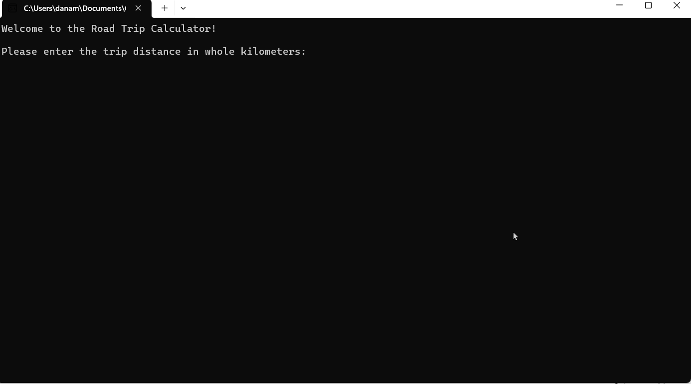

# Winter 2026 Assignment 02 - Control Structures and Error Handling
__Weight:__ 10% of final mark

__Submission requirements:__ On or before the deadline, commit a Visual Studio 2022 project to the GitHub repository. __You must commit and push to the classroom repository supplied for the assignment__; do not create your own repository. It is your responsibility to ensure that your work is in the correct repository. ___Work not in the repository will not be graded___.

## Road Trip Calculator

You and your best friend are going on a road trip during Reading break, and as financially responsible adults, are creating a budget for your estimated costs. Eager to put your new programming skills to work, you decide to create a program to do the calculations for you.

### Requirements
The program will need to prompt the user for several inputs, namely:

- the total distance of the trip in whole kilometers
- whether you'll travel in their vehicle or yours

Your vehicle has a fuel efficiency of 11.9 L per 100 km and your best friend's vehicle has a fuel efficiency of 8.7 L per 100 km.

The program will need to simulate the price of gas for this trip. Generate a random value between $1.40 and $2 to simulate the cost of 1 L of fuel. The simulated price only needs to be generated once during the program's execution. 
_NOTE: For testing purposes, you may set the cost to a fixed amount. Ensure your final submission makes use of the generated value._

Finally, your program should account for the cost of coffee and road snacks, which you estimate will be as follows:

| Trip Distance | Food costs |
|--|--|
| Less than 200 km | $30 |
| 200km - 499 km | $50 |
| 500km - 999 km | $80 |
| More than 1000km | $120 |

For example, let's say you input a trip of 800km driving your vehicle, and the simulated gas price was $1.80 per L.
- Your vehicle requires 11.9 L per hundred km, which means this trip will use 95.2 L of fuel.
- 95.2 L of fuel at $1.80 per L will cost $171.36.
- You will spend $80 on snacks.
- The total cost will be $171.36 + $80 = $251.36.

The program must display all the calculated results to the user, then ask if they'd like to perform another calculation. The program must allow the user to submit multiple trips, ending only when the user chooses to end the program. The program must also not crash or abnormally terminate due to any user input or internal processing; display appropriate error messages and recover from any errors gracefully.

## Coding Requirements
- A C# comment block at the beginning of the source file describing the purpose, author, and last modified date of the program
- Write only one statement per line
- Use camelCase for local variable names
- Use ALL_CAPS for any constant variable names
- Use defensive programming where necessary
- Ensure graceful handling of exceptions

### Sample Runs
_NOTE: the full functionality and logic of this program is not demonstrated in the samples below.  **You will need to develop your own test plan and sample runs for the full program.**_
The following GIF demonstrates the functionality of the program for one set of inputs:

## Submission
Commit and push your solution to your GitHub classroom assignment repository before the deadline. Ensure that your solution follows the best coding and style practices, as your instructor has shown you in class. Failed adherence to the prescribed style guidelines may result in lost marks. __Your program must compile; a program that fails to compile will not be graded.__

_NOTE: push early and often to your repository to receive feedback from your instructor prior to the deadline. Your instructor will not be providing feedback for every commit every day. However, the earlier and more often you commit, the greater the chances of your instructor reviewing your work and providing constructive feedback that you can act on before the deadline._

## Rubric (out of 15 marks)

| Criteria |  Good (3 marks) | Acceptable (2 marks) | Needs Work (1 mark) | Unsatisfactory (0 marks)
|-|-|-|-|-|
| Structure | Program prompts for all required inputs, appropriate data types are used, and program loops until user quits. | 1-2 minor errors in data types or loop logic. | Missing inputs, missing loop, or major logic errors. | Not completed.
| Calculations | Calculated values are correctly calculated.	 | 1-2 minor errors in calculation. | Major errors or missing parts of calculation. | Calculations not attempted.
| Exception Handling | Program does not crash for any reason. | Program crashes on invalid input in some cases. | Program crashes on invalid input in most/all cases. | Program does not run / was not completed.
| Correctness | All tests pass. | Most tests pass. | Some tests pass. | No tests pass.
| Best practices | Code follows course best practices including good naming conventions, properly aligned output, opening comment block, and appropriate use of comments. | 1-2 minor errors or violations. | 3+ errors or standard violations. | No alignment, documentation, or appropriate names.

Generative AI is not permitted for this assignment: suspected uses of academic misconduct will be investigated following the NAIT Academic Integrity policy and Academic Misconduct procedure and may result in a grade of zero.

